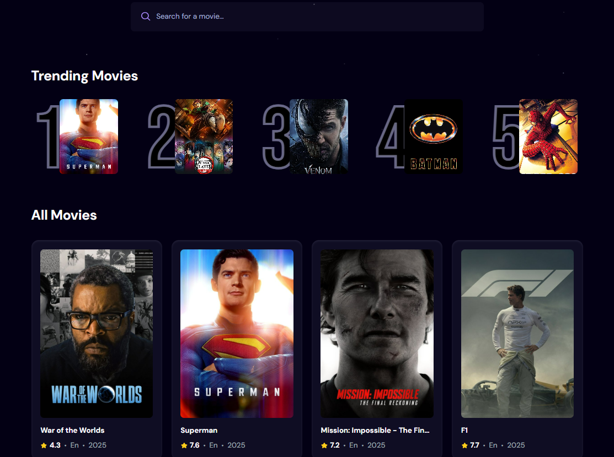
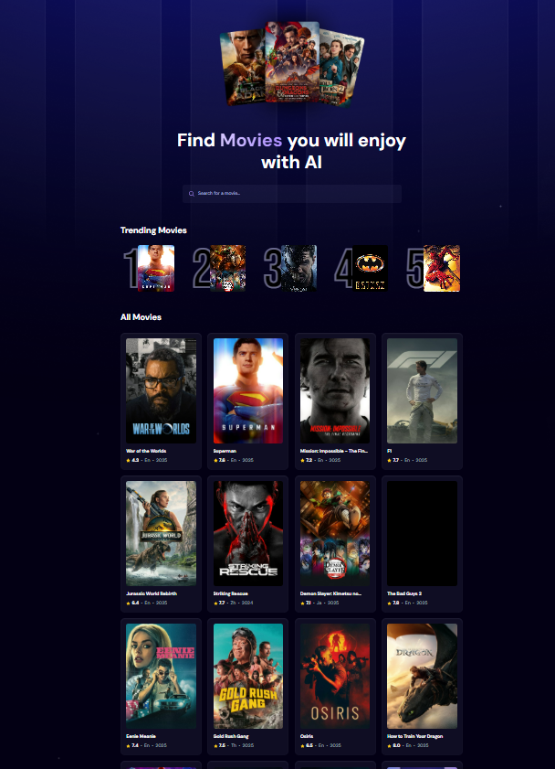

# 🎬 TrendFlix - Movie Trend App




TrendFlix is a modern React application that displays trending movies, allowing users to explore popular films, view details, and search for their favorites. The app fetches data from a movie API and presents it in a clean, responsive UI.

---

## 🚀 Features
- View trending movies
- Search for movies by title
- See movie details (poster, rating, overview, release date)
- Responsive design for mobile and desktop

---

## 🛠️ Technologies Used
- React (Hooks, Components)
- JavaScript (ES6+)
- Tailwind CSS (Modules or styled-components)
- Movie Database API (TMDb)
- AppWrite (Backend & Database)

---

## 📦 Project Structure
```
TrendFlix/
│
├── README.md
├── package.json
├── public/
│   └── ...assets
└── src/
	 ├── App.jsx
	 ├── index.js
	 ├── components/
	 │   └── MovieCard.jsx
	 ├── pages/
	 │   └── Home.jsx
	 └── styles/
		  └── App.css
```

---

## ⚡ Setup & Run
1. Install dependencies:
	```bash
	npm install
	```
2. Start the development server:
	```bash
	npm run dev
	```

---

## How the app works?
The movie API fetches data from TMDB. The data is mapped to show various cards which is made using component and props. The search input also makes API calls. To not overload server with many API calls `useDebounce` is used to wait a period of time after the user has written a search text before the API call is made. The ** searchTerm ** is recorded with a count in ** Appwrite ** which is then later on used to show the trending movies. So, as each user searches a movie the trending movies change according to the number of seraches that have been made stored in appwrite database.

## 📚 What I Learned
- How to fetch and display API data in React
- Component-based architecture and props
- Responsive UI design
- Managing state and effects with React Hooks
- Using appwrite as a reliable backend technology
- Using `useDebounce` hook to optimize search for API calls in the search input.

## Thank you
