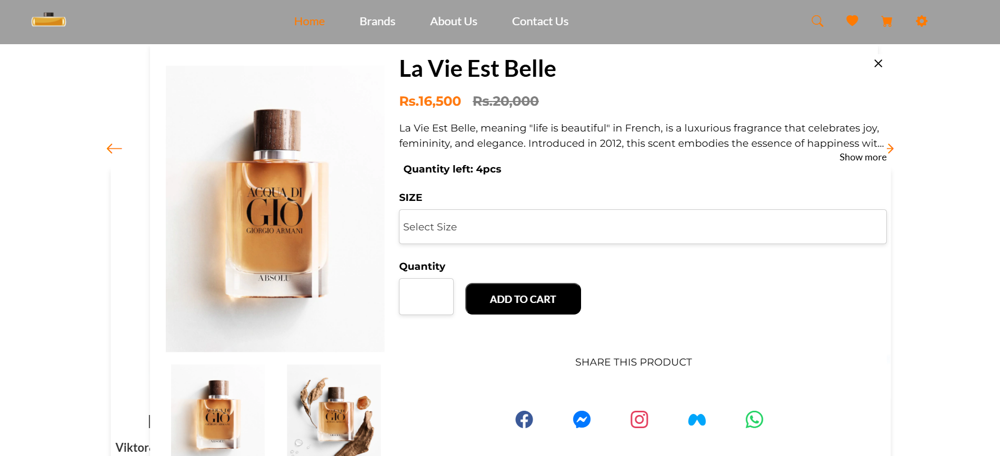
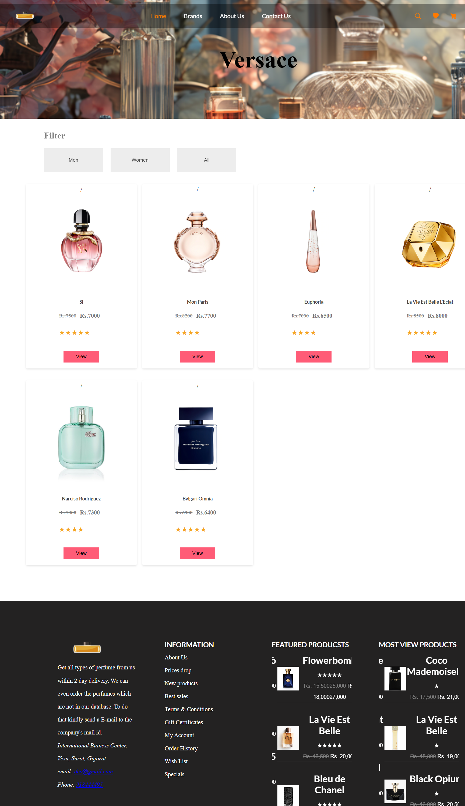
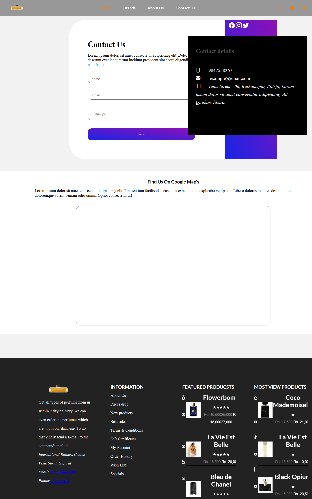
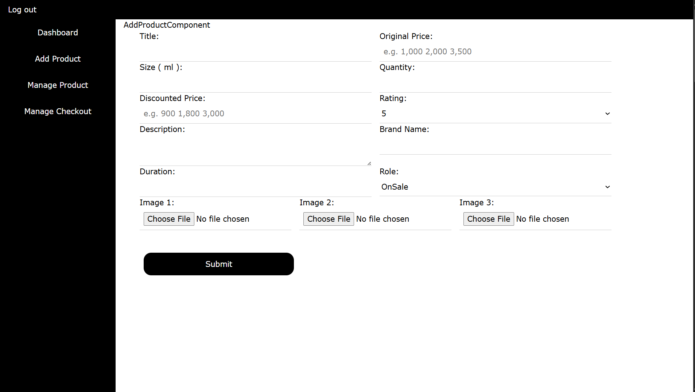
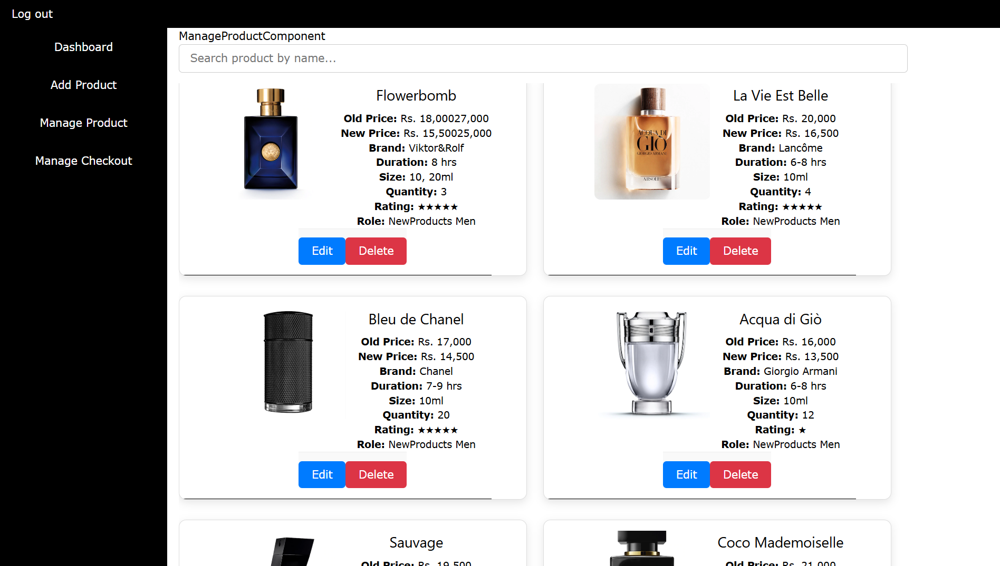

# Perfume Ecommerce

A full-stack MERN (MongoDB, Express, React, Node.js) ecommerce application for selling perfumes online. This project features a modern frontend, robust backend, and secure payment gateway integration using Stripe.

## Table of Contents
- [Features](#features)
- [Tech-Stack](#tech-stack)
- [Project-Structure](#project-structure)
- [Frontend](#frontend)
- [Backend](#backend)
- [API-Endpoints](#api-endpoints)
- [Payment-Gateway-stripe](#payment-gateway-stripe)
- [Setup-Instructions](#setup-instructions)
- [Screenshots](#screenshots)
- [License](#license)

## Features
- User authentication (Sign Up, Login)
- Product listing and search
- Shopping cart and checkout
- Order history and reports
- Payment processing with Stripe
- Responsive UI
- User Delivery Status Tracking 

## Tech-Stack
- **Frontend:** React, Vite
- **Backend:** Node.js, Express
- **Database:** MongoDB
- **Payment:** Stripe

## Project-Structure
```
api/        # Backend (Node.js/Express)
frontend/   # Frontend (React/Vite)
```

## Frontend
- Built with React and Vite for fast development and performance.
- Located in the `frontend/` directory.
- Key files: `App.jsx`, `main.jsx`, `RouterComponent.jsx`, and components in `Components/`.
- Features product browsing, cart management, and checkout UI.

### Running Frontend
```bash
cd frontend
npm install
npm run dev
```

## Backend
- Built with Node.js and Express.
- Located in the `api/` directory.
- Handles REST API endpoints for products, users, checkout, and Stripe payments.
- MongoDB connection via `database/connection.js`.
- Controllers manage business logic (e.g., `AllProductsController.js`, `CheckoutController.js`, `StripeController.js`).

### Running Backend
```bash
cd api
npm install
npm start
```

## API-Endpoints
Below are the actual API endpoints used in the project:

| Endpoint                | Description                       |
|-------------------------|-----------------------------------|
| `/check`                | Check operations                  |
| `/user`                 | User operations                   |
| `/allproducts`          | All products                      |
| `/slideshowdata`        | Slideshow data                    |
| `/signup`               | User registration                 |
| `/login`                | User login                        |
| `/newproductsmen`       | New products for men              |
| `/checkoutTotal`        | Checkout operations               |
| `/stripe`               | Stripe payment integration        |
| `/payment`              | Payment operations                |

_Note: All endpoints are prefixed by the backend base URL (e.g., `/api`)._

## Payment-Gateway-stripe
- Stripe integration for secure payment processing.
- Backend route: `api/router/stripeRoute.js` and controller: `api/controller/StripeController.js`.
- Frontend connects to backend for payment via Stripe API.
- Handles payment intent creation, confirmation, and error handling.

### Stripe Setup
1. Create a Stripe account and get your API keys.
2. Add your Stripe secret key to backend environment/config.
3. Use Stripe's React components or API for frontend payment forms.

## Setup-Instructions
1. **Clone the repository:**
   ```bash
   git clone <repo-url>
   ```
2. **Install dependencies:**
   - Backend: `cd api && npm install`
   - Frontend: `cd frontend && npm install`
3. **Configure environment variables:**
   - Backend: Add MongoDB URI and Stripe secret key.
4. **Start servers:**
   - Backend: `npm start`
   - Frontend: `npm run dev`
5. **Access the app:**
   - Frontend: [http://localhost:5173](http://localhost:5173)
   - Backend: [http://localhost:5000](http://localhost:5000)

## Screenshots











## Thank you


