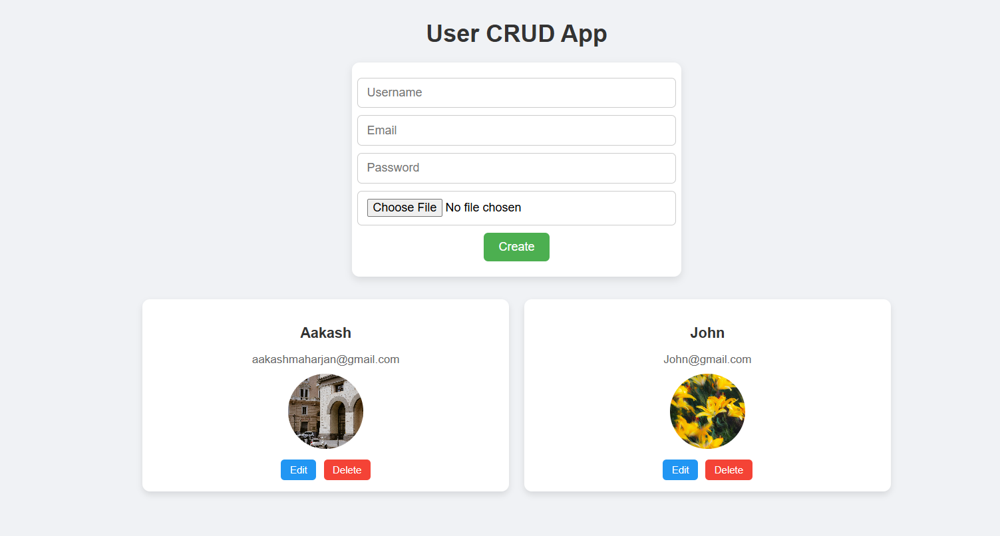

# User CRUD App



A full-stack CRUD application built with **React** for the frontend and **Express + MongoDB** for the backend. Users can be created, read, updated, and deleted along with profile image upload.

---


## Table of Contents

- [Features](#features)
- [Technologies](#technologies)
- [Frontend Setup](#frontend-setup)
- [Backend Setup](#backend)
- [Project Structure](#project-structure)
- [API Endpoints](#api-endpoints)
- [What I Learned](#what-i-learned)

---

## Features

- Create users with:
  - Username
  - Email
  - Password
  - Profile Image (PNG/JPG)
- View all users
- Edit existing users (update fields and image)
- Delete users (removes user and their image)
- Frontend styled with CSS-in-JS

---

## Technologies

- **Frontend:** React, Axios  
- **Backend:** Node.js, Express, MongoDB, Mongoose, Multer  
- **File Uploads:** Multer  
- **Image Storage:** Server-side `uploads` folder  

---

## Frontend Setup

1. Navigate to the frontend folder:

```bash
cd frontend
npm install
npm install axios
npm run dev
```


## Backend
```bash
cd api
npm install express mongoose multer cors
npm start
```

---

## Project Structure

```
CRUD/
│
├── README.md
├── frontend/
│   ├── package.json
│   ├── public/
│   └── src/
├── api/
│   ├── package.json
│   ├── uploads/
│   └── src/
│       ├── models/
│       ├── routes/
│       └── server.js
└── image.png
```

## API EndPoints
```
| Method | Endpoint        | Description                   |
| ------ | --------------- | ----------------------------- |
| GET    | /api/users      | Get all users                 |
| POST   | /api/users      | Create a new user with image  |
| PUT    | /api/users/\:id | Update a user and image       |
| DELETE | /api/users/\:id | Delete a user and their image |
```
## What I learned by building this Project?
- React Hooks: useState, useEffect

- Props & Forms: Handling form inputs, file uploads

- Axios: Making GET, POST, PUT, DELETE requests

- Express & MongoDB: CRUD operations with Mongoose

- Multer: Handling file uploads

- Node.js fs module: Deleting uploaded images from server

- CSS-in-JS: Inline styling React components