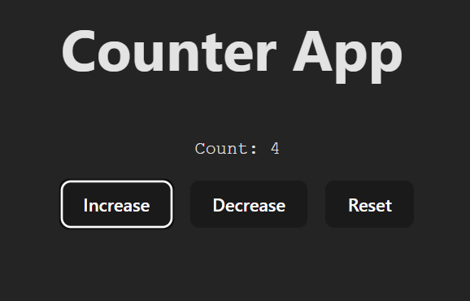

# A simple react counter app



A simple counter application built with **React** that allows you to increase, decrease, and reset the count.  
It demonstrates the use of **React Hooks (`useState`)** and basic **event handling**.

## ✨ Features
- 🔢 Display current count
- ➕ Increase button to increment the count
- ➖ Decrease button (never goes below 0)
- 🔄 Reset button to set the count back to 0
- 🎨 Styled with CSS for a clean UI 

## 📂 Project Structure
```
Counter_App/
├── eslint.config.js
├── index.html
├── package.json
├── README.md
├── vite.config.js
├── public/
│   ├── vite.svg
│   └── image.png
└── src/
    ├── App.css
    ├── App.jsx
    ├── index.css
    └── main.jsx
```

## What I have learned by building this App?
- `useState` is a React hook that lets a component remember a value and update it when something changes.
- Project structure of a React App and the various files and there use.

## Thank you
