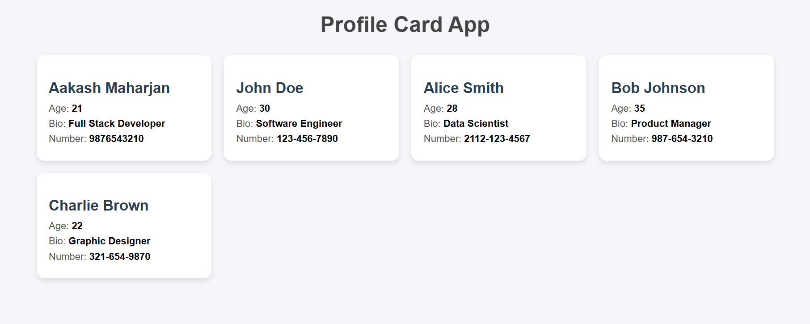

# 📇 Profile Card App



A simple **React app** using **props** and reusable components.  
This project displays multiple profile cards styled with inline CSS.

---

## 🚀 Features
- Reusable `ProfileCard` component  
- Passes props like `name`, `age`, `bio`, and `number`  
- Responsive card layout using CSS Grid  
- Clean UI with shadows and rounded corners  

---

## 📂 Project Structure
```
Profile-Card-App/
│
├── README.md
├── index.html
├── package.json
├── vite.config.js
├── eslint.config.js
│
├── public/
│   ├── image.png
│   └── vite.svg
│
└── src/
    ├── App.css
    ├── App.jsx
    ├── ProfileCard.jsx
    ├── index.css
    └── main.jsx

```
## 📚 What I Learned by Making this App
- **Components** are reusable functions in React that return UI elements.  
- **Props** allow you to pass data from a parent component to a child component.  

## Thank you

