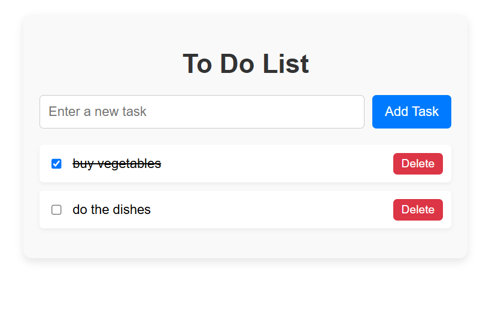

# React To-Do List App



A simple **To-Do List app built with React** that allows users to add, complete, and delete tasks. The app also uses **localStorage** to persist tasks across page reloads.

---

## Features

- Add new tasks  
- Mark tasks as completed (with line-through styling)  
- Delete tasks  
- Tasks are saved in **localStorage**, so they persist even after refreshing the page  

---

## Technologies Used

- **React** (useState, useEffect)  
- **JavaScript**  
- **HTML & CSS** (inline styles)  
- **localStorage** for persistent data  

---

## Project Structure
```
To-Do-App/
│
├── README.md
├── index.html
├── package.json
├── vite.config.js
├── eslint.config.js
│
├── public/
│   ├── image.png
│   └── vite.svg
│
└── src/
    ├── App.css
    ├── App.jsx
    ├── index.css
    └── main.jsx
```

## What I learned from making this App?
- `useEffect` can be used to load data at the start or if a variable `tasks` changes

- I learned to take input and pass it to a func `addTasks`

- `...tasks` the spread operator is used to spread the data like array

- `localstorage` is used to keep data persistent

## Thank you